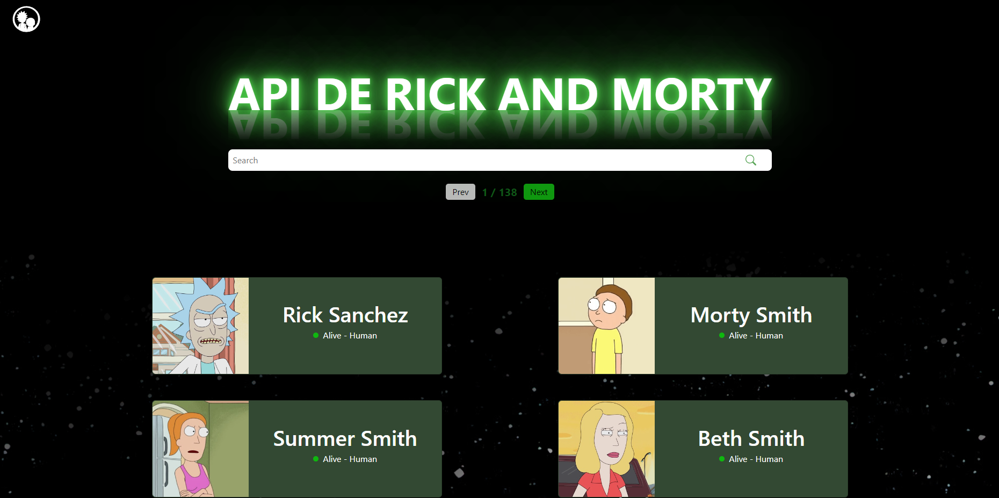

# Rick and Morty - Web Application

### Check out the website here 🔍

[Rick and Morty - Web Application](https://rick-and-morty-chi-five-92.vercel.app)

### What is it 🤔

This is an application developed to list characters from the Rick and Morty series containing animations and using Bootstrap.

### Why was it made 🤔

At the moment (2024) I am studying at [Growdev](https://www.growdev.com.br/) in the fullstack web developer course and I am currently in the Front-end III module (In this module we learn more about CSS, including flexbox, animations,
keyframes, responsiveness and Bootstrap). And as the last challenge of this module, we were asked to create this web application to consume the [Rick and Morty API](https://rickandmortyapi.com) and list its characters.